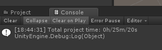
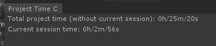

# Unity Project Time Counter

When I use Unity, I often wonder how much time it took to do my projects. Unity Project Time Counter measures gives you such preview. The data is serialized to a .dat file and the time of the current session and the total time can be previewed in the Unity editor in a special window.

## Setup

Download .unitypackage from link below, and import it to your Unity project or copy the contents of the Editor folder to the Editor folder in your project. If you do not have the Editor folder, simply create it.

## How to use it

Each time you start the project, the console will display information about the time you have spent. If you want to check it later, go to Window / Project Time Counter and a window will open where you can check the the current session and all time spent with the project.

## Screenshots

## Download links
https://github.com/lisembart/UnityProjectTimeCounter/releases/download/1.0/UnityProjectTimeCounter.unitypackage
